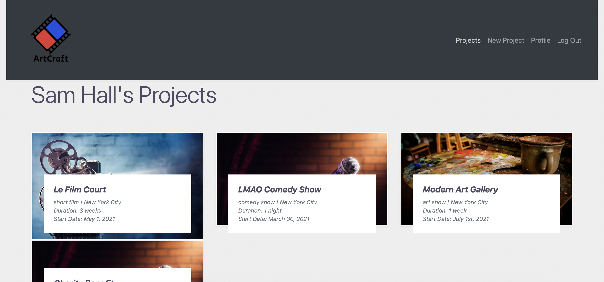

🎞 Welcome to ArtCraft! 🎨

This single page app is a virtual artist collective in which users can create projects and add other users as collaborators to said projects.

Installation:
- Fork and clone this repository
- "bundle install" if necessary 
- [Open ArtCraft Backend](https://github.com/samhall330/ArtCraftBackend)
- Run "rails s" in the terminal 
- Open the ArtCraft Frontend
- Run "npm start" 

Navigating the app:
- Sign Up/Log in
- Add artistic Specialties including a "Professional Level" for each Specialty.
- Add Equipment with optional product page link.
- Add Software with optional product page link.
- Create a Project by selecting "New Project" in the NavBar.
- See all active projects by selecting "Projects" in the NavBar.
- "Search Collaborators" on each unique project page will redirect to a search bar in which you can search for users based on any specialties, equipment or software they have added to their profile.
- Click "Add Collaborator" and select the project that you wish to add this user to.
- See collaborators listed on unique project page.
- Log out by selecting the option in the NavBar.

🎤 Created by Sam Hall 🎭